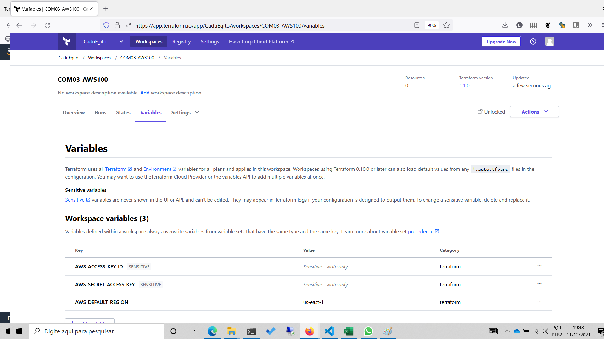

**Add a cover photo like:**

# Starting the first project

## Introduction

I picked up the project [COM03-AWS100 - Launch a Hello World website on the internet](https://github.com/100DaysOfCloud/100DaysOfCloudIdeas/blob/master/Projects/COM/COM03/COM03-AWS100.md) from 100DaysOfCloudIdeas.

## Prerequisite

As a prerequisite to developing this project, I stated at the beginning of my 100DaysOfCloud journey that I should do the activities in the Infrastructure as a Code (IaC) way. So, I must write the IaC code for this project using Terraform.
## Use Case

Objectives

Complete the following:

    - Launch a linux based EC2 instance in any one region of your choice in a public subnet
    - Setup a security group that allows http/https connections from the Internet, and ssh from your IP address
    - SSH into the EC2 instance
    - Setup a webserver on the EC2 instance
    - Add a simple hello world header to the index.html file
    - Hit the public IP address from a browser and confirm the site is served

Answer the following:

    - What is a region?
    - What is an availability zone?
    - What is a public subnet?
    - How many subnets can there be in one region?
    - How to launch EC2 instances in public / private subnets?
    - What are AMIs?
    - What are security groups?
    - What are inbound/outbound rules?
    - What is deny By default rule in security groups?
    - How to allow access to EC2 from security groups?
    - How to connect to EC2 instances from your machine?
    - How to setup your simple static site with EC2

### Step 1 — Configuration of the programmatic access for Terraform in AWS IAM

### Step 2 — Configuring Terraform Cloud to automate the deploy on AWS

### Step 3 — Start

## ☁️ Cloud Outcome

✍️ (Result) Describe your personal outcome, and lessons learned.

## Next Steps

✍️ Describe what you think you think you want to do next.

## Social Proof

✍️ Show that you shared your process on Twitter or LinkedIn

[link](link)
