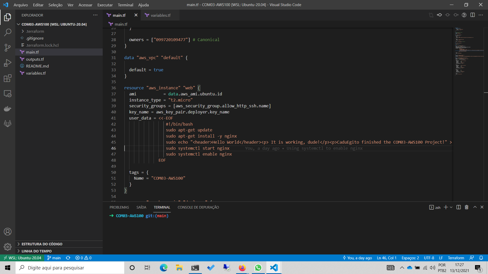

# Finishing the first project

## Introduction

I spent almost the entire Sunday to finish the project [COM03-AWS100 - Launch a Hello World website on the internet](https://github.com/100DaysOfCloud/100DaysOfCloudIdeas/blob/master/Projects/COM/COM03/COM03-AWS100.md) from 100DaysOfCloudIdeas. Indeed, to learn by doing is very important.

## Prerequisite

I continued the activities started yesterday. 
## Use Case

Objectives

Complete the following:

    - Launch a linux based EC2 instance in any one region of your choice in a public subnet
    - Setup a security group that allows http/https connections from the Internet, and ssh from your IP address
    - SSH into the EC2 instance
    - Setup a webserver on the EC2 instance
    - Add a simple hello world header to the index.html file
    - Hit the public IP address from a browser and confirm the site is served

Answer the following:

    - What is a region?
    - What is an availability zone?
    - What is a public subnet?
    - How many subnets can there be in one region?
    - How to launch EC2 instances in public / private subnets?
    - What are AMIs?
    - What are security groups?
    - What are inbound/outbound rules?
    - What is deny By default rule in security groups?
    - How to allow access to EC2 from security groups?
    - How to connect to EC2 instances from your machine?
    - How to setup your simple static site with EC2

### Code to meet the objective

The Terraform code that I wrote to meet the objective stated above is avaiable in the link below.

---> Repository: [COM03-AWS100](https://github.com/eduardoegito/COM03-AWS100).
### Answers to the questions above

    - What is a region?
      - Regions are geographic locations where AWS groups datacenters.
    - What is an availability zone?
      - Avaiability zones are one or more distinct datacenters with redundant energy, network, and connectivity inside a AWS Region.  
    - What is a public subnet?
      - A public subnet is a subnet that's associated with a route table that has a route to an internet gateway.
    - How many subnets can there be in one region?
      - There is no limit.
    - How to launch EC2 instances in public / private subnets?
      - To launch EC2 instance in public/private subnets, you need to specify it at the moment of creation or do it through IaC code, like Terraform or AWS CloudFormation.
    - What are AMIs?
      AMI stands for Amazon Machine Image. An AMI provides the information required to launch an instance.
    - What are security groups?
      - A security group acts as a virtual firewall for your instance to control inbound and outbound traffic.
    - What are inbound/outbound rules?
      - Inbound/outbound rules are definitions inside a security group to specify what kind of traffic is allowed to communicate to a device associated to this security group.
    - What is deny By default rule in security groups?
      - It means that if there isn't a rule allowing the traffic, that traffic will be denied.
    - How to allow access to EC2 from security groups?
      - To allow access to an EC2 instance, you need to specify it at the moment of creation or do it through IaC code, like Terraform or AWS CloudFormation.
    - How to connect to EC2 instances from your machine?
      - It can be done creating a key pair from the console, and associating it to the instance at the moment of creation or do it through IaC code, like Terraform or AWS CloudFormation.
    - How to setup your simple static site with EC2
      - It can be done through UserData script at the moment of creation, by the console, or using Terraform (or another IaC tool). Or it can be done by the execution of commands after connecting to the instance by SSH. 
## ☁️ Cloud Outcome

After some reasearch, I could finish the Terraform code and the server was reacheble by SSH and HTTP, showing the result as expected.

### The final result

## Social Proof

The posts that show that I shared my process on Twitter or LinkedIn are avaiable below.

[Tweet post](https://twitter.com/eduardoegito/status/1470190084200833027)

[LinkedIn post](https://www.linkedin.com/posts/eduardoegito_100daysofcloud-aws-terraform-activity-6875955909852442624-LqcR/)